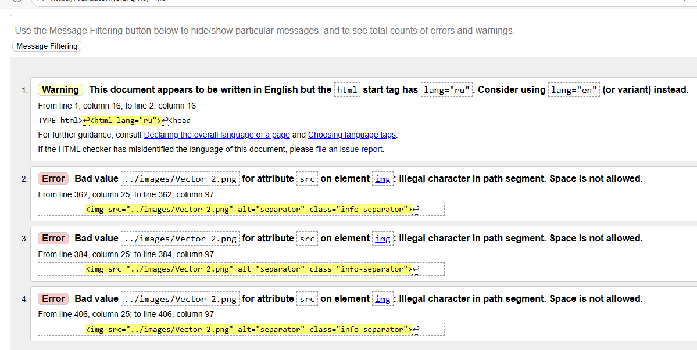
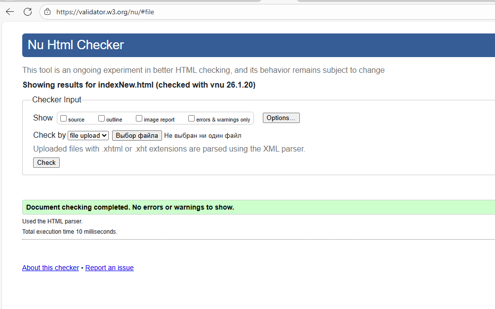

1. **DRY (Don't Repeat Yourself):**
- Добавлены CSS переменные для цветов, шрифтов и отступов
- Создан единый класс .contact-form для всех форм
- Вынесены повторяющиеся значения в переменные
- Удалены дублирующиеся медиа-запросы

2. **KISS (Keep It Simple, Stupid):**
- Упрощена структура HTML (удалены лишние обертки)
- Упрощены селекторы CSS

3. **YAGNI (You Ain't Gonna Need It):**
- Удален дублирующий слайдер в Projects секции
- Удалены неиспользуемые CSS селекторы
- Удалена дублирующаяся строчка подключения шрифтов

4. **SOLID:**
- Single Responsibility: Кнопки имеют базовый класс .button
- Open-Closed: ничего не придумала
- Interface Segregation: Медиа-запросы разделены по ответственности
- Dependency Inversion: не придумала ничего

5. Проверка через **валидатор** (скрины ниже)
   Первая проверка и после исправления ошибок
   
   

6. Установить **линтер** Beautify —  не удалось, так как более не поддерживается. Попытка установить аналог Prettier также не увенчалась успехом. В связи с чем, попробовала сделать код HTML красивее через онлайн сервисы по ссылке https://beautifytools.com/html-beautifier.php. Он убрал лишние отступы и код стал красивее.  

7. **Основные изменения по БЭМ:**
1. Структура именования классов:
.header-navigation → .nav
.header-navigation_item → .nav__item
.header-navigation_item a → .nav__link
.button-secondary → .button_secondary
.section-title-center1 → .section-title_center .section-title_color_white

2. Изолированные блоки:
Навигация (.nav) - независимый компонент
Форма (.form) - переиспользуемый компонент
Карточки (.repair-card, .client-card) - самостоятельные блоки
Управление слайдером (.slider-controls) - отдельный компонент

3. Модификаторы:
button_secondary - для второстепенной кнопки
button_size_small - для маленькой кнопки
section-title_center - для центрированного заголовка
form_theme_dark - для темной темы формы
tabs__item_active - для активного таба

4. Повторное использование:
Навигация используется в header и footer
Форма используется в нескольких секциях
Кнопки - единый компонент с модификаторами
Заголовки секций - единый компонент

В мобильной версии по БЭМ:

1. Утилитарные классы:
.width-100 - для полной ширины
.text-center - для центрирования текста
.display-none / .display-block - управление отображением
.flex-column / .flex-row - флекс-утилиты

2. Медиа-запросы с БЭМ:
@media (max-width: 768px) {
    .block__element_mobile {
        /* стили для мобилок */
    }
    
    .block__element_tablet {
        /* стили для планшетов */
    }
}